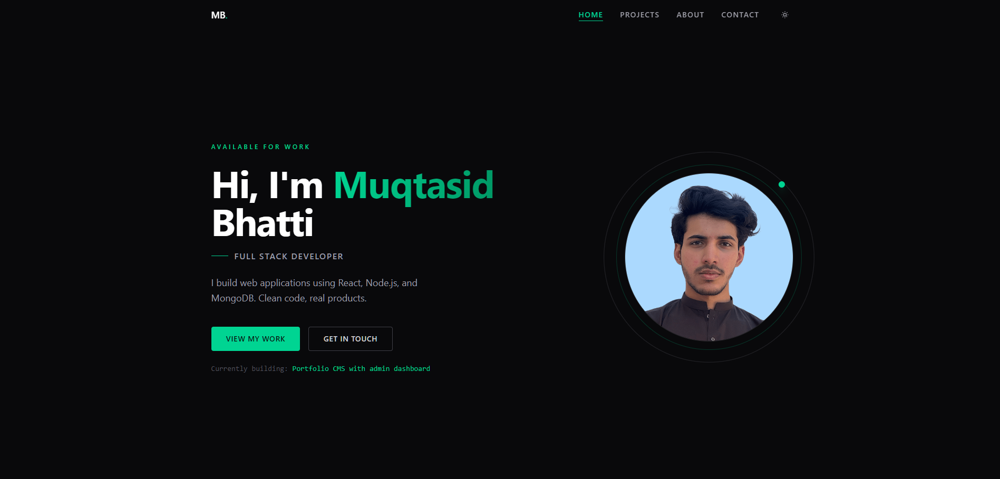
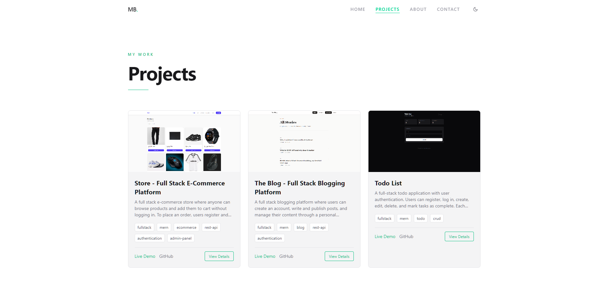
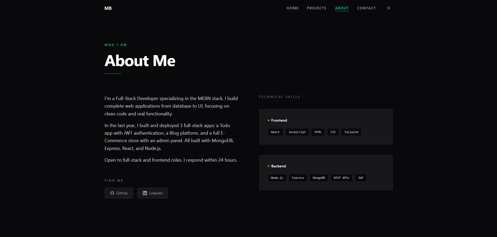
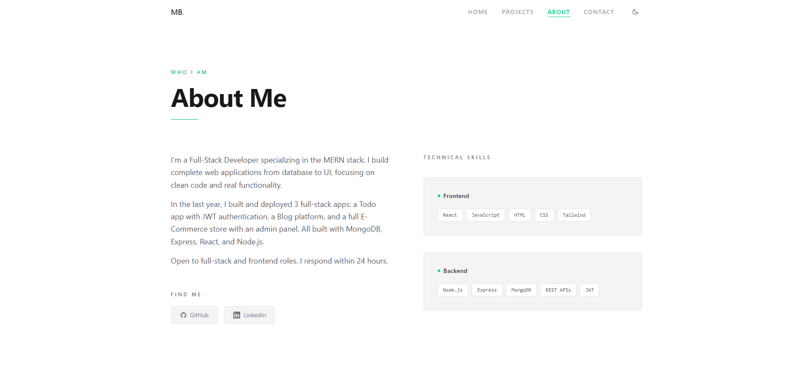
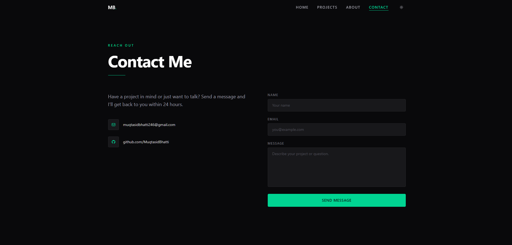
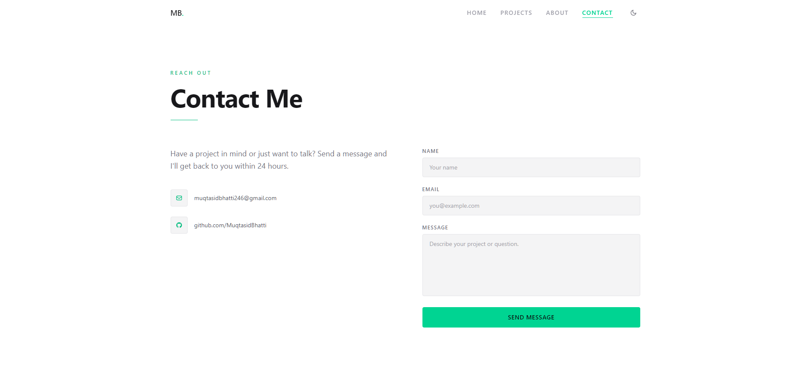

# Portfolio Frontend

Personal portfolio website with project showcase and admin dashboard.

## Tech Stack
React, Tailwind CSS, Vite, Axios

## Features
- Home page with hero section and stats
- Projects page with live demo and GitHub links
- About page with skills breakdown
- Contact form
- Light / Dark mode toggle
- Admin dashboard to add, edit, and delete projects (protected route)

## Screenshots

## Setup
1. Clone the repo
2. Run `npm install`
3. Create a `.env` file with:
   - `VITE_API_URL=http://localhost:5000`
4. Run `npm run dev`

## Live Demo
[Link here once deployed]

## Backend Repo
https://github.com/MuqtasidBhatti/portfolio-backend